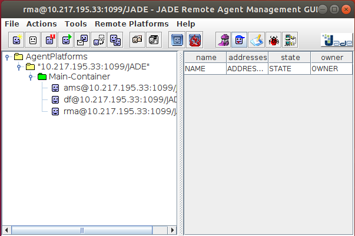
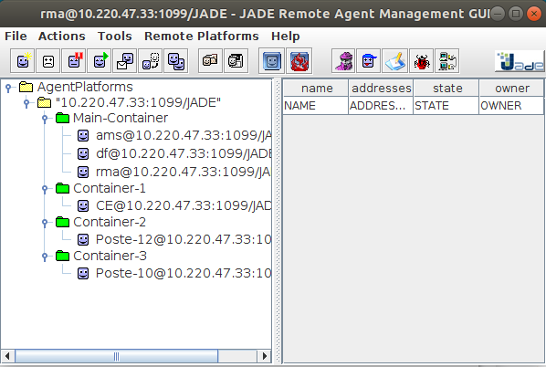
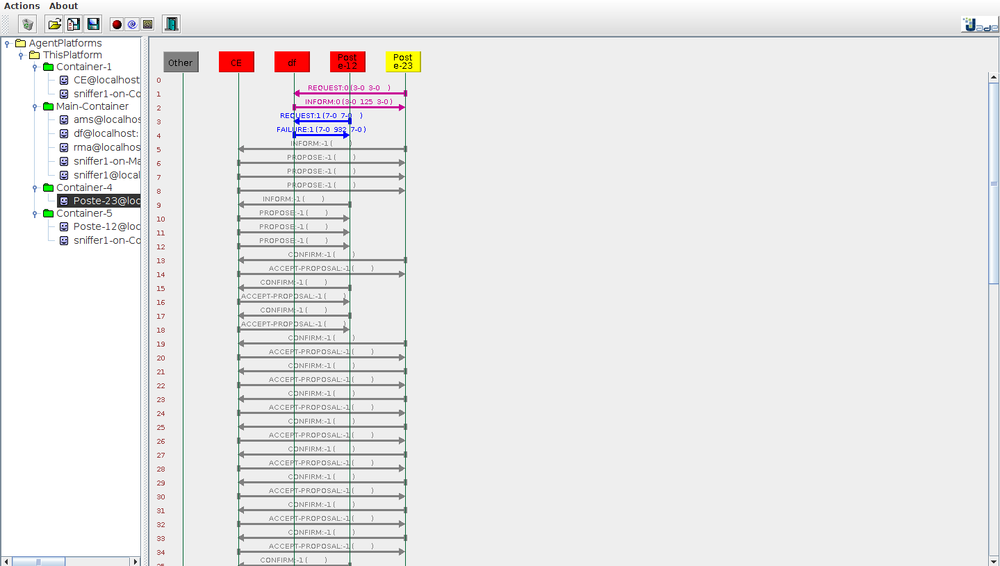
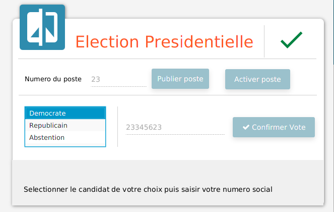
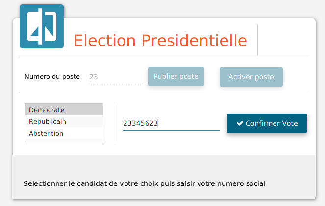
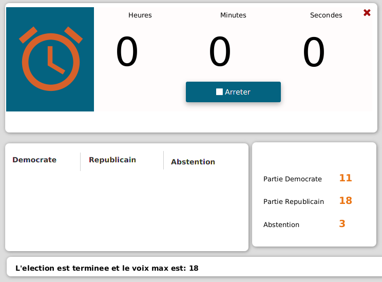

L’objectif fondamental de ce TP n’était pas de créer un Système de vote pour faire
l’administration des élections dans un pays, car un tel système doit s’appliquer à tout le matériel
système, logiciels, télécommunications et documentation destinés à être utilisés. 

Mais vous aurez une idée sur les système multi agents et la plateforme Jade

Jade Remote Agent          |  Jade Remote Agent With Containers
:-------------------------:|:-------------------------:
 | 

#### Actions
| 

#### GUI
Avant la sélection         |  Après la sélection
:-------------------------:|:-------------------------:
 | 

Résultat         |
:-------------------------:|
 |

### Outils

* IDE Eclipse
* Language Java
* Framework JavaFx
* BD MySQL
* Présentation visuel Scene Builder
  * ControlsFX
  * FontAwesomeFx
  * JFoenix
* Framework Jade
